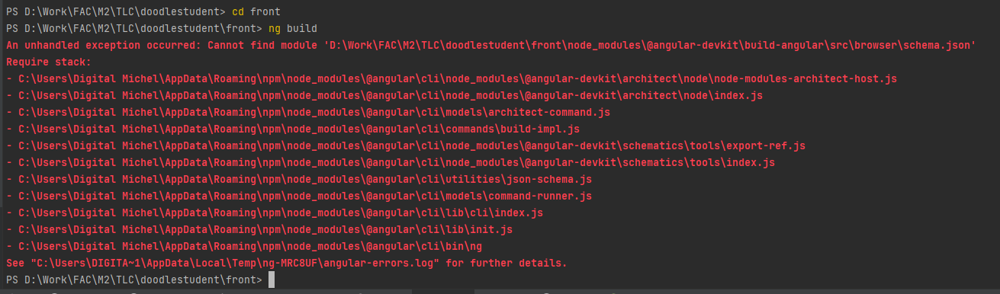
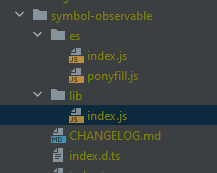
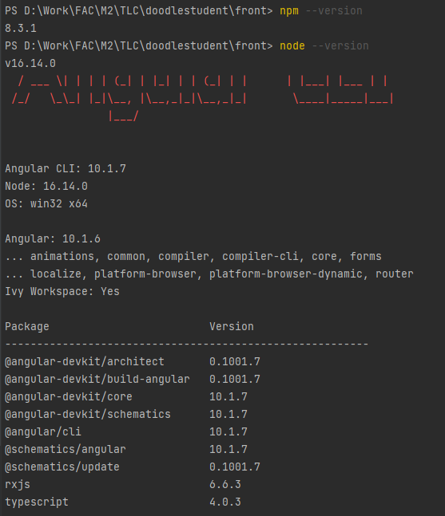
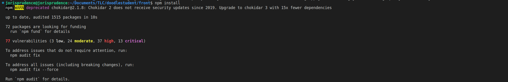
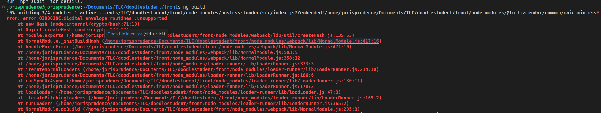

# TLC - Projet - Compte-rendu
Beaugas Charly,
Benveniste Jules

## Etat du projet : non-fonctionnel

- api : dockerisé et ajouté au docker-compose avec une dépendance sur la bd.
- front : non-fonctionnel, impossible de build (même en local).

## Difficultés rencontrées

Le front ne compile sur aucune de nos machines

### Problème n°1 :

Fichier manquant provoquant l'échec du build

versions node, npm & angular à l'issu de nos tentatives de fix :

### Problème n°2 :

échec du build (librairies obsolètes ?)

versions node, npm & angular à l'issu de nos tentatives de fix :

### Fix tentés :

- tentative de build le front seul dans un projet différent en suivant à la lettre les versions précisées dans les fichiers package.json
- improvisation de ponyfill.js
- revert complet de l'état de notre branche au commit 9e99b2065710d4f5fc745fdf75afb068fae2940b du 04/01/2021 pour y retenter le build

## Conclusion

Il nous a été impossible de build la partie front du projet et donc de la conteneuriser et de passer à la suite. Le projet peut être lancé à l'aide de la commande `docker-compose up -d`  )
Ayant fait l'erreur d'essayer trop longtemps de corriger les problèmes sus-cités, nous n'avons pas pu consacrer de temps à l'optimisation des images utilisées.